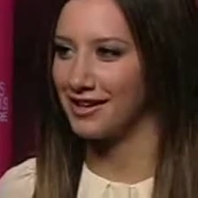
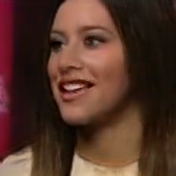

## Pose Manipulation with Identity Preservation
[](https://paperswithcode.com/sota/talking-head-generation-on-voxceleb2-8-shot?p=pose-manipulation-with-identity-preservation-1)

### [Paper](http://www.univagora.ro/jour/index.php/ijccc/article/view/3862)
Pose Manipulation with Identity Preservation. Andrei-Timotei Ardelean, Lucian Mircea Sasu in 
International Journal of Computers Communications & Control





Official PyTorch implementation of CainGAN, used to perform few-shot image generation. Starting from one or more source pictures, 
the model can synthesize face images in novel poses while preserving the person's identity.


### [License](https://github.com/TArdelean/CainGAN/blob/master/LICENSE.md)

Copyright (C) 2019 Andrei-Timotei Ardelean, Lucian Mircea Sasu

All rights reserved.
Licensed under the [CC BY-NC-SA 4.0](https://creativecommons.org/licenses/by-nc-sa/4.0/legalcode) (**Attribution-NonCommercial-ShareAlike 4.0 International**)

## Demo
##### Sources
![img1-src] ![img6-src] ![img4-src] ![img5-src]
##### Generated (one shot)
![img1-gen] ![img6-gen] ![img4-gen] ![img5-gen]

##### Image animation (one shot)
![vid1-src] ![vid1-gen] ![vid2-src] ![vid2-gen]

## Installation
A ready to use conda environment is provided. To create the python environment run:
```
conda env create -f environment.yaml
conda activate fewshot
```

To train the model you can use the train script.
```
python train.py --K 8 --cuda_visible 0 --data_root vox2selection/mp4 
```
This will train an 8-shot model on GPU 0.
Change `data_root` path to the directory of your dataset. The format of the directory is expected to be similar to the 
one used in [VoxCeleb2](http://www.robots.ox.ac.uk/~vgg/data/voxceleb/vox2.html) dataset.  
The `extract_landmarks.py` script can be used to precompute landmarks for faster training. For example:
```
python extract_landmarks.py --data_root vox2selection/mp4 --output_path vox2selection/land --device 'cuda'
```

## Acknowledgement
Special thanks go to Xperi Corporation that provided the environment and physical resources that made this work possible.


## Citation
Should you find this work useful for your research, please cite:
```
@article{IJCCC3862,
	author = {Andrei-Timotei Ardelean and Lucian Sasu},
	title = {Pose Manipulation with Identity Preservation},
	journal = {International Journal of Computers Communications & Control},
	volume = {15},
	number = {2},
	year = {2020},
	issn = {1841-9844},
	doi = {10.15837/ijccc.2020.2.3862},
	url = {http://univagora.ro/jour/index.php/ijccc/article/view/3862}
}
```

[img1-src]: demo/1-src.png
[img1-gen]: demo/1-gen.png
[img2-src]: demo/2-src.png
[img2-gen]: demo/2-gen.png
[img3-src]: demo/3-src.png
[img3-gen]: demo/3-gen.png
[img4-src]: demo/4-src.png
[img4-gen]: demo/4-gen.png
[img5-src]: demo/5-src.png
[img5-gen]: demo/5-gen.png
[img6-src]: demo/6-src.png
[img6-gen]: demo/6-gen.png
[img7-src]: demo/7-src.png
[img7-gen]: demo/7-gen.png

[vid1-src]: demo/monalisa-src.jpg
[vid1-gen]: demo/monalisa.gif
[vid2-src]: demo/vincenzo-src.jpg
[vid2-gen]: demo/vincenzo.gif
[vid3-src]: demo/michael-src.jpg
[vid3-gen]: demo/michael.gif
